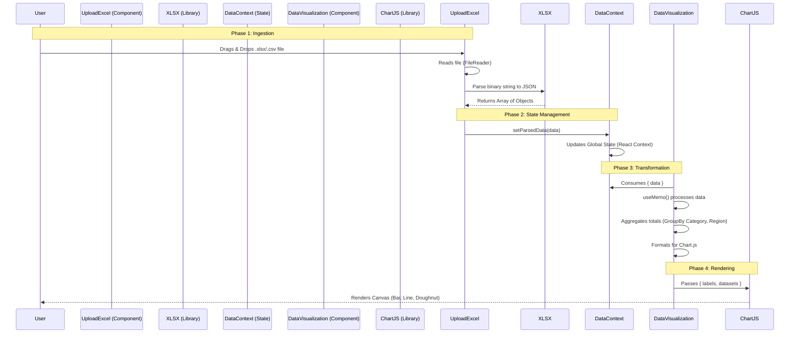

# Data Visualization Guide & Architecture

## 1. Common Chart Types for Data Analytics

Here are the most common chart types used in business intelligence and when to use them:

| Chart Type | Best Use Case | Example |
| :--- | :--- | :--- |
| **Bar Chart** (Biểu đồ cột) | Comparing values across categories. | Sales by Product Category, Revenue by Month. |
| **Line Chart** (Biểu đồ đường) | Showing trends over time. | Stock prices, Website traffic over a year. |
| **Pie / Doughnut Chart** (Biểu đồ tròn) | Showing composition or parts of a whole (best for < 5 categories). | Market Share, Expenses breakdown. |
| **Scatter Plot** (Biểu đồ phân tán) | Showing correlation between two variables. | Advertising spend vs. Sales revenue. |
| **Area Chart** (Biểu đồ miền) | similar to line charts but highlights the magnitude of change. | Accumulated revenue over time. |
| **Heatmap** | Visualizing data density or intensity in a matrix. | User activity by hour of the day and day of week. |
| **Radar Chart** | Comparing multiple variables for a single item. | Product feature comparison (Price, Quality, Speed, Support). |

## 2. System Data Flow

Here is how the data travels from the user's Excel file to the vibrant charts on your dashboard.

## 3. Current Implementation Details

- **Input**: We use `react-dropzone` to capture the file.
- **Parsing**: `xlsx` library converts the spreadsheet rows into a JSON array.
- **Storage**: We use React Context (`DataContext`) to hold this array in memory so any component (Preview, Charts, AI) can access it without re-parsing.
- **Visualization**: `react-chartjs-2` (wrapper for Chart.js) renders the graphics.
